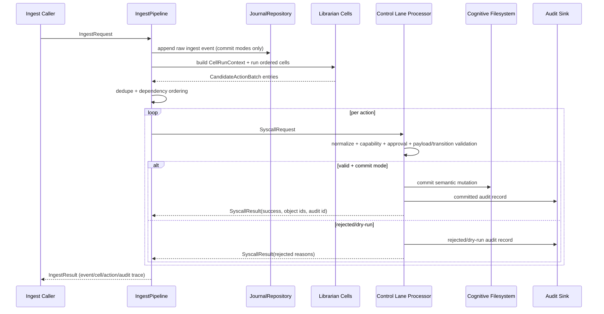

# FORGE Ingest Pipeline (Phase 4)

Phase 4 activates the FORGE-only ingest flow:

`raw input -> journal event -> librarian cells -> candidate semantic actions -> Control Lane validation -> cognitive filesystem commit`

Core rule:

**Cells propose. Kernel validates. FORGE commits.**

## End-to-end flow

## Request and result contracts

Contracts live in `services/core/internal/aios/domain/ingest.go` and shared TS mirrors in `packages/shared/src/aios.ts`.

- `IngestRequest`: input kind, content/payload, actor/source, scope, provenance, correlation/trace, dry-run, commit mode, metadata, timestamp.
- `IngestResult`: event id, proposed/accepted/rejected actions, committed ids, warnings/errors, audit ids, per-cell diagnostics, action batches, summary.
- `CandidateActionBatch`: per-cell action bundle with source event id and trace metadata.
- `CellRunContext` / `CellRunResult`: runtime cell contracts with scoped read-only context and structured diagnostics.

## Cell execution order

Default deterministic order:

1. `IntakeCell`
2. `CatalogCell`
3. `LinkerCell`
4. `ContradictionCell`
5. `StateCell`
6. `PatternCell`
7. `RecallCell`
8. `CleanupCell`

Pipeline startup validates cell dependencies and rejects cycles/missing dependencies.

## Pipeline modes

- `validate_only`:
  - runs cells and syscall validation in dry-run mode
  - writes no semantic objects
  - returns accepted/rejected validation results
- `commit_valid`:
  - runs cells and commits actions that pass kernel validation
  - invalid actions are rejected with deterministic reasons
  - valid independent actions continue
- `commit_all_or_fail`:
  - currently **deterministically unsupported**
  - reason: cross-action atomic batch transactions are not available through current syscall interface
  - pipeline returns structured unsupported-mode error with no semantic commits

## Dry-run policy

Dry-run and `validate_only` behavior:

- raw ingest event is virtualized (`virtual-*` id), not persisted to journal
- semantic actions are sent to kernel with `dryRun=true`
- no semantic writes are committed
- audit/rejection diagnostics remain visible via syscall results

## Ordering, dedupe, and idempotency

Pipeline canonicalizes candidate actions before kernel submission:

- dedupes semantically equivalent `CREATE_NOTE` and `CREATE_LINK` actions
- preserves merged proposer provenance (`proposedByCells`) during dedupe
- ordering priority:
  - `CREATE_NOTE`
  - `OPEN_LOOP`
  - `UPDATE_STATE`
  - `CREATE_LINK`
  - `MARK_SUPERSEDED`
  - `REGISTER_CONTRADICTION`
  - `DERIVE_MODEL`
  - `ARCHIVE_NOTE`
  - `CLOSE_LOOP`
  - `COMPILE_CONTEXT`
- synthesizes deterministic action idempotency keys from ingest id/idempotency key + action fingerprint
- idempotent ingest replay reuses existing journal event id when already persisted

## Rejections and failure handling

- validation/capability/approval failures are returned as structured `rejectedActions` with deterministic error codes
- kernel processing errors are surfaced as typed ingest errors (`KERNEL_PROCESS_FAILED`)
- cell runtime errors are captured per-cell and returned in diagnostics
- no validation failure is swallowed

## Provenance and audit trace

Each proposed action carries:

- source event id
- cell name/version
- ingest id
- candidate batch id
- actor/source/provenance
- workspace scope
- correlation/trace ids

Each syscall result carries:

- deterministic success/reject status
- rejected reason codes (if any)
- committed object ids (if committed)
- audit id

This provides an end-to-end chain:

`ingest request -> journal event -> cell batch -> syscall request -> syscall result/audit id -> committed objects`

## Phase 5 truth-engine integration

Ingest pipeline now instantiates and wires `truth.Engine` into cell runtime context and ingest output diagnostics:

- runtime context field:
  - `CellRunContext.Truth`
- ingest result field:
  - `IngestResult.truthDiagnostics`

Current truth-aware behavior:

- `StateCell` checks current scoped state and suppresses duplicate `UPDATE_STATE` proposals when value is already current.
- `ContradictionCell` checks known contradiction/supersession records and avoids duplicate conflict proposals.
- `PatternCell` skips archived/superseded candidates and suppresses model proposals when supporting evidence is contradicted.
- `RecallCell` includes contradiction warnings for relevant state hints.
- `CleanupCell` uses truth stale-loop queries when available.

For each syscall outcome, pipeline records a `TruthApplySummary` in `truthDiagnostics.apply` so ingest responses include action-to-truth projection trace metadata.

## Current limitation

- `commit_all_or_fail` atomic batch commit is intentionally unsupported in this phase.
- Full context compilation remains Phase 6; Recall in Phase 4 returns lightweight hints and optional `COMPILE_CONTEXT` proposals only when explicitly enabled.

## Phase 5.75 autonomy hook integration

Ingest can optionally trigger bounded post-commit autonomy evaluation:

- option: `IngestPipelineOptions.AutonomyPass`
- depth cap: `IngestPipelineOptions.MaxAutonomyDepth`
- request metadata depth key: `autonomyDepth`

Behavior:

- skipped for `dry_run` and `validate_only`
- depth-capped to prevent recursive autonomy loops
- autonomy outcomes are attached to:
  - `IngestResult.autonomyRuns`
  - `IngestResult.truthDiagnostics.autonomyRuns`

This preserves a deterministic chain from ingest event to any self-initiated follow-up actions while keeping all durable writes syscall-mediated.
