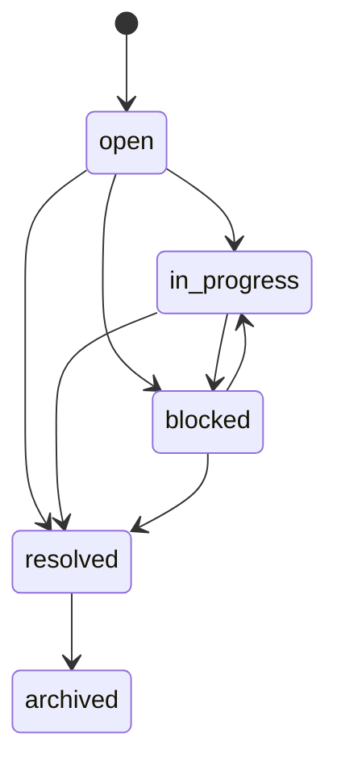

# Open Loops (Phase 5)

Open loops are first-class unresolved commitments in FORGE, not freeform text.

They capture blockers, pending decisions, and unfinished work with explicit lifecycle rules.

## Lifecycle states

- `open`
- `in_progress`
- `blocked`
- `resolved`
- `archived`

## Allowed transitions

- `open -> in_progress`
- `open -> blocked`
- `open -> resolved`
- `in_progress -> blocked`
- `in_progress -> resolved`
- `blocked -> in_progress`
- `blocked -> resolved`
- `resolved -> archived`

`archived` is terminal.

`resolved -> open` is rejected by default in current implementation.

## Transition diagram

## Kernel enforcement

- Loop transitions are validated in Control Lane transition rules.
- Mutations are committed only through semantic syscalls (`OPEN_LOOP`, `CLOSE_LOOP`).
- Cells may propose transitions, but cannot directly write loops.

## Lifecycle operations

Implemented in `services/core/internal/aios/truth/engine.go`:

- `OpenLoop`
- `TransitionLoop`
- `ResolveLoop`
- `BlockLoop`
- `ReopenLoop` (currently subject to transition rules; resolved/archived reopen is rejected)
- `ArchiveLoop`
- `ListActiveLoops`
- `ListBlockedLoops`
- `ListLoopsByPriority`
- `ListLoopsByOwner`
- `ListStaleLoops`
- `ExplainLoop`

## Stale handling

- Stale means "needs attention", not auto-close.
- Staleness is deterministic by updated timestamp cutoff.
- Default stale threshold in truth engine is 72 hours unless overridden.
- Stale queries never mutate loop state.
- Cleanup cell emits warnings for stale loops; it does not auto-resolve.

## Blockers, owner, priority

Loop records include:

- `priority`
- `owner`
- `blocker`
- `next_action`
- `related_notes`
- `created_from`

Query surfaces support scoped lists by active/blocked/stale/priority/owner.

## Explainability

`ExplainLoop` returns structured state for a loop:

- current lifecycle state
- priority/owner/blocker/next action
- source linkage (`createdFrom`, related notes)
- updated timestamp
- stale status at provided cutoff

## Scope isolation

- Loop reads and writes are scoped by workspace/lane.
- Cross-scope loop explanation/resolution is treated as not found in that scope.
